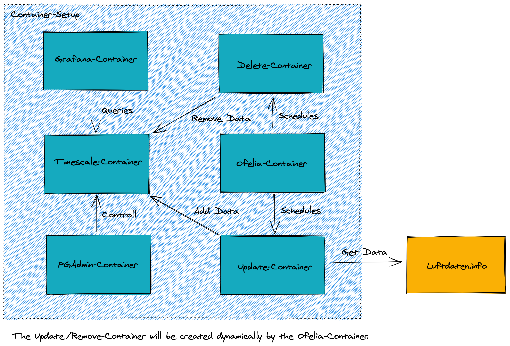

# Deployment-Guide für Docker-Compose

## Aufbau
Grundsätzlich sind derzeit alle Komponenten in Docker gehostet. 
Dadurch ist die gesamet Lösung plattformunabhängig und kann daher auf allen gängigen OS ausgeführt werden.

In der folgenden Darstellung kann man den aktuellen Containeraufbau des Projektes sehen:


## Konfiguration

Die Konfiguration *muss* über das `.env`-File vorgenommen werden.
Derzeit werden folgende Settings benötigt:
``` sh 
DB_HOST=<IP-Adresse von der DB>
DB_PORT=<Port von der DB> 
DB_NAME=<Name der Datenbank>
DB_USER=<User für Operationen>
DB_PASSWD=<Passwort für DB>
ADMIN_MAIL=<Email für PG-Admin>
ADMIN_PASSWORD=<Passwort für PG-Admin>
```

Sollte kein `.env`-File erstellt werden, kann die Anwendung nicht gestartet werden.

## Ausführung

Zur Ausführung des Projektes müssen nur zwei Kommandos ausgeführt werden:

1. Builden der Container
``` sh 
    docker-compose build
```

2. Eigentliche Ausführung des Projektes
``` sh
    docker-compose up -d
```

## PG-Admin4

Um die Datenbank leichter zu verwalten, wurde das Tool PG-Admin4 als Interface zur Datenbank hinzugefügt.

Um auf PG-Admin4 zuzugreifen muss einfach auf die Adresse `localhost:8080` zugegriffen werden.
Es sollte ein Login-Seite erscheinen die wie folgt ausschaut:

Die Logindaten können in der .env Datei konfiguriert werden.